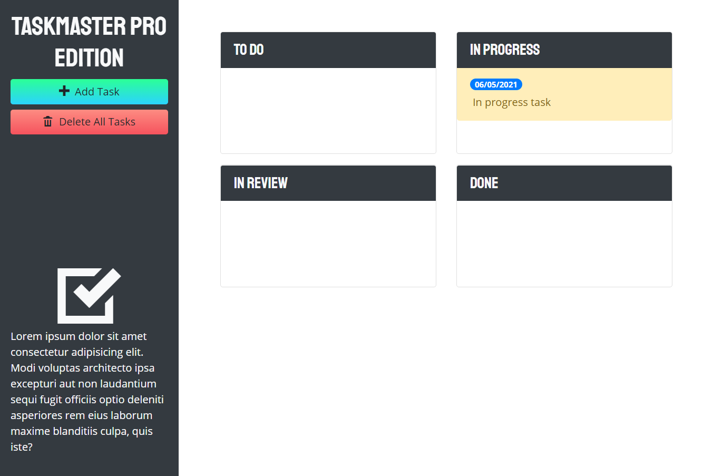

# Taskmaster Pro

## Description
Kanban board that allows movement between to do, in progress, in review and completed columns.

Table of Contents |
-------------------|
[Installation](#Installation)
[Usage](#Usage)
[Technologies](#Technologies)
[Screenshots](#Screenshots)
[Contributing](#Contributing)
[Tests](#Tests)
[Author](#Author)
[Questions](#Questions)

 

## Usage

The web application is designed to allow users to add items to whichever list they currently belong to. The application allows for drag-and-drop movement between the lists. When Adding a task, a modal will appear that allows for users to add in a task description and due date. After the task  is created, both the date and description of the task can be clicked on to edit the task. Dragging a task to the bottom of the screen allows for a task to be deleted while the Delete All Tasks button deletes all tasks that are on the board.

You can find the deployed link and the repository link below:

Deployed Link: [Deployed Link](https://cerafinn.github.io/taskmaster-pro)

Repo Link: [Repo Link](https://github.com/cerafinn/taskmaster-pro)

 

## Technologies

* HTML
* CSS
* JavaScript
* BootStrap
* jQuery
* Moment
* Google Fonts
* Open Iconic

 

## Screenshots

## Contributing

If interested in contributing to the project, feel free to reach out. Contact information can be found in the Questions section.

 

## Author

Andaleeb Farooq: [:octocat:](https://github.com/cerafinn)

 

## Questions

If you have any questions or issues, feel free to reach out at: andaleeb.farooq@gmail.com.
You can also find more of my work on Github at [github link](https://github.com/cerafinn).